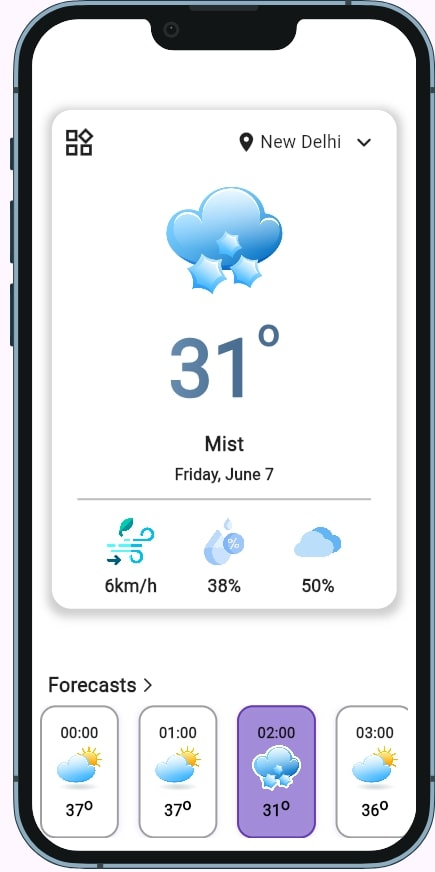
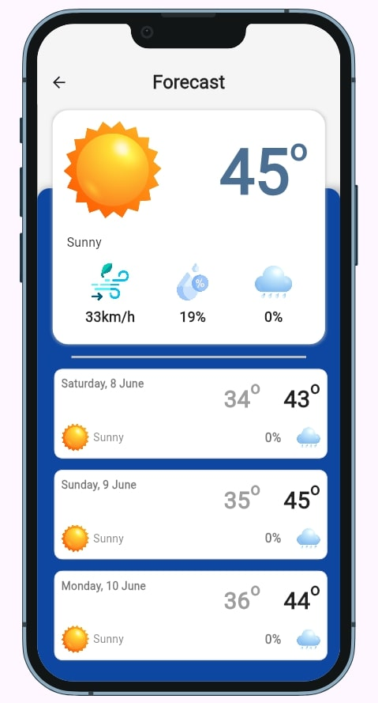

# WeatherApp

A new Flutter project.

This is a realtime weather app, made with Flutter.
It uses a free weather api to fetch the realtime weather information.


## The API is provided by [weatherapi](https://www.weatherapi.com/).

Replace the API_KEY in home.screen.dart with your own API_KEY.


## How to run the app

clone the repository :

```
git clone https://github.com/ankurt02/WeatherApp_flutter.git
```

add required dependancies to pubspec.yaml

```
flutter pub get
```

in the root directory, run the code

```
flutter run
```


# Screenshot of flutter app

<div style="display: flex; justify-content: space-between; margin : 20px; padding : 20px">
    
    
</div>


# TODO

- [X] Make a simple UI

- [ ] Make the app responsive for large screens

- [ ] Make a favourites section to bookmark for easy access to selected cities


 
Flutter :blue_heart: